# Netwerklaag

---

### Recap Fysieke laag

MAC-adres (Medium Access Control)

Functie switch

note:
- je machine beschikt over een hardwareadres genaamd een MAC-adres (medium access control)
- functie was: data van machine A naar machine B krijgen
- vraag: waarom niet gewoon MAC-adressen en switches?
- antwoord: switch onthoudt **alle** adressen achter een bepaalde poort (binnen netwerk afgebakend door router)
- heel het Internet zou één lokaal netwerk zijn, dus zouden per poort enorm veel informatie moeten bijhouden

---
| kenmerk | MAC | IP |
|-|-|-|
| sterkte associatie | "vast" | "veranderlijk" |
| structuur | vlak | hiërarchisch |
| afhankelijk van | fabrikant | subnet |
| vergelijk met | rijksregisternummer | thuisadres |
---
basisidee bereikbaarheid

note:
- vinden niet de machine, wel het (meest specifieke) subnet
- op subnet gebeurt een "broadcast"
- dus IP-adres wordt op het einde omgezet naar MAC-adres
---


# IPv4 (classless)

note:

Bestaat ook ouder systeem met "klassen". Niet belangrijk voor programmeurs.

---

- 192.168.0.222


---

Een IP-adres is een **uniek adres** dat gebruikt wordt om apparaten binnen een netwerk te identificeren. 

32 bits in IPv4 (weergegeven als vier decimale getallen)


128 bits in IPv6 (4 * 4 hexadecimale getallen)


note:
- 4 bytes = 32 bits
- je mag rekenmachine in programming mode gebruiken

---

In binair:

```text
11000000.10101000.00000000.11011110 # 192.168.0.222
11111111.11111111.00000000.00000000 # 255.255.0.0
11000000.10101000.00000000.00000000 # 192.168.0.0
```

---

IPv4 adres bestaat uit twee delen:

- netwerkgedeelte
- hostgedeelte

---

## Netwerkmasker IPv4

Eerste X bits

- Steeds hetzelfde binnen het hetzelfde netwerk
- Wordt ingesteld in de router door het **subnetmasker** in te stellen, bv:

```
255.255.0.0 (decimaal) == 1111 1111.1111 1111.0000 0000.0000 0000 (binair)
```

Waar een nulletje staat, kan door een apparaat gekozen worden (*)

note:

- binair altijd reeks 1'tjes gevolgd door reeks 0'en, zonder afwisseling
- machines op zelfde netwerk hebben zelfde netwerkgedeelte (ander hostgedeelte)
  - **in binair**, zelfde netwerkgedeelte kan voorgesteld zijn met andere reeks getallen in decimaal!
- (*) Toekenning IP-adressen: zie straks

---

## Netmasker

CIDR-notatie: tel het aantal eentjes

```
192.168.0.0/16 
```

note:
- Eerste 16 bits op 1 == 255.255.0.0

---

```
192.168.3.222, subnet: 255.255.255.0
```

- Wat is het netwerkdeel?
- Wat is het host-deel?
- Hoe zou je een electronisch apparaat ontwerpen dat dit kan detecteren?

---

```
192.168.3.222, subnet: 255.255.128.0 (aka: /17)
```

- Wat is het netwerkdeel?
- Wat is het host-deel?

note:
- netwerkdeel: 192.128.0.0
- Host-deel: 0.40.3.22

---

```
192.168.3.222, subnet: 255.255.64.0
```

- Wat is het netwerkdeel?
- Wat is het host-deel?

note:
Strikvraag! Dit is een ongeldig netmasker (0100 0000 = 64, er zit een nul tussen de eentjes)
Dit soort vragen ook op het examen/tussentijdse toets!

---

### Zit host H/X op netwerk N/Y?


- we moeten het netwerk van H achterhalen
- neem het IP van H
- pas een netmasker van X bits toe
  - levert het netwerkgedeelte van H
  - dus: het kleinste netwerk waarin H zit
- bekijk het resultaat:
  - identiek aan N en X=Y? ⇒ ja
  - iets anders? ⇒ volgende slide


---

### Is netwerk N1/X deel van netwerk N2/Y?

- X < Y? ⇒ nee (korter netmasker = groter netwerk)
- X = Y? ⇒ enkel als N1 = N2 (zelfde netwerk)
- X > Y?
  - pas netmasker van Y bits toe op N1
  - is de uitkomst N2? ⇒ ja
  - iets anders? ⇒ nee
  
---

### Speciale adressen

- Netwerkadres
- Broadcast-adres


note:
- netwerkadres (alle hostbits op 0) = adres van een netwerk zelf, niet van een machine
  - wordt niet echt op zich gebruikt, maar kan ook niet dienen voor host
  - komt omdat netmasker toepassen hier niets aan verandert
- broadcastadres: alle hostbits zijn 1, dus hoogst mogelijke adres binnen dat netwerk
  - gebruikt om een bericht naar iedereen op het netwerk te sturen
- denkvraag: hoe veel hosts kunnen we aansluiten op een netwerk met netmasker van lengte N
  - antwoord: 2^(32-N)-2 ("twee minder dan twee tot de macht H, waarbij H het aantal hostbits is")
---

### Oefeningen

Met "netwerkadres" wordt bedoeld: het IP-adres van een netwerk, niet van een gewone host.

- Is 10.4.3.0/16 een mogelijk netwerkadres?
- Is 192.168.0.0/16 een mogelijk netwerkadres?
- Is 192.168.0.0/8 een mogelijk netwerkadres?
- Is 10.4.224.0/18 een mogelijk netwerkadres?


---

### Oefeningen

- Is 172.25.13.0/24 een subnet van 172.16.0.0/12?
- Is 172.16.0.0/13 een subnet van 172.16.0.0/12?
- Met welke eerste bytewaarde kunnen subnetten van 10.0.0.0/8 allemaal beginnen?
- Met welke eerste twee bytewaarden kunnen subnetten van 200.16.0.0/12 allemaal beginnen?

---

### Oefening

- IP-adres: 192.168.1.13
- lengte netmasker: 27

Gevraagd:

- Netwerkadres
- Broadcastadres
- Hostgedeelte (binair)
- Eerste en laatste hostadres subnet
- Maximaal aantal hosts

---

### Oefening

- IP-adres: 172.16.5.88
- lengte netmasker: 20

Gevraagd:

- Netwerkadres
- Broadcastadres
- Hostgedeelte (binair)
- Eerste en laatste hostadres subnet
- Maximaal aantal hosts

---


### Oefening

- IP-adres: 10.4.3.2
- lengte netmasker: 18

Gevraagd:

- Netwerkadres
- Broadcastadres
- Hostgedeelte (binair)
- Eerste en laatste hostadres subnet
- Maximaal aantal hosts

---

IP-adressen voor:

- subnetten (netwerk en broadcast)
- routers
- hosts
- **niet** voor modems, hubs of switches

note:
voor routers minstens twee

---

# Routers

---

### Routers

Toestel met twee of meer **fysieke** netwerkinterfaces

Inspecteert adresinformatie en stuurt door op juiste interface

Voorbeeld: hotspot op je GSM (Wifi <-> Mobiel)


note:

Fysieke netwerkinterfaces, dus bv: twee kabel-aansluitingen, of kabel+wifi, of meerdere wifi-antennes in één apparaat. Kan evengoed een desktop-computer met 2 netwerkkaarten zijn.
Loopbak (127.0.0.1) telt niet. Met virtuele machines en netwerken in één computer zit er wél een virtuele router in je PC - maar dit is een randgeval!

Gewone hardware kan dus als router optreden, maar speciale apparatuur is (energie)-performanter.

---

### (Default) gateway

note:
- "gateway" wijst op grens tussen systemen.
- in netwerkconfiguratie wordt hiermee bedoeld: router die dit netwerk van de rest afbakent
- Moet dus bereikbaar zijn op het netwerk.

---


note:

- Eens op juiste netwerk doet machine een broadcast om te vragen wie een bepaald IP heeft.
- Het is dus genoeg om iets tot bij de router te krijgen die aangesloten is op dat subnet.

---

### Inter-netwerk routing (LAN/MAN, zonder peering)

```mermaid 
flowchart LR
UPLINK{ISP 🌐} --> A

A[10.\*.\*.\*] --> B[10.10.\*.\*]
B --> C[🖥️ 10.10.0.1]
B --> F[📱 10.10.0.2]

A --> H[10.20\*.\*]
H --> I[🖥️ 10.20.8.3]
H --> K[🖥️ 10.20.175.213]
H --> L[📱 10.20.85.42]
```


Hoe gaat een pakketje van 10.20.8.3 naar 10.10.0.1?
Hoe gaat een pakketje van 10.20.8.3 naar 82.199.86.103?

note:
uitbeelden, ev. met post-it
Bij iedere _router_ wordt gekeken: in of uit het subnet?
Niet in het subnet: naar "boven" via default gateway

note: inter-ISP-routing is minder hierarchisch


---

# TTL

---

# TTL

Time To Live

note: Waarom noodzakelijk?

---

Foute configuratie van routers:
hun default gateways vormen een loop


Wat gebeurt er als we hier een pakketje op zetten?

note:

Met zo'n configuratie heb je sowieso géén internetconnectiviteit, want pakketjes raken niet naar buiten.

Het zou "op het internet" echter wel kunnen voorkomen dat ISPs per ongeluk zo'n lus maken _voor een specifieke bestemmingsrange_. Bv: ISP A denkt dat de kortste weg naar 17.*.*.* via ISP B is. ISP B denkt dat dit via ISP C is.

ISP C was vroeger verbonden met het netwerk van 17.*, maar nu niet meer (kabelbreuk) maar is vergeten om ISP B hiervan op de hoogte te stellen. Kortom, ISP C stuurt dan maar door naar ISP A...

---

# ICMP

---

# ICMP

Internet Control Message Protocol

note:

wordt gebruikt om netwerkconnectiviteit te testen, wordt gebruikt door PING en TRACEROUTE

Steunt enkel op de netwerklaag (en onderliggende lagen), maakt dus niet volledig gebruik van de OSI-stack

---

## Hoe krijgt een apparaat een IP-adress?

---

## Hoe krijgt een apparaat een IP-adress?

Stel: 192.168.1.0/24
Twee apparaten sluiten gelijktijdig aan.

Indien ze willekeurig kiezen: kans op zelfde adres?

note:
254 mogelijke IP-adressen, kans van 1/254 op een conflict
-> Zeer hoog, zeker in het kader van een malicious actor

---

### Toekenning van adressen (LAN)

Statisch

De IT'er van het bedrijf geeft manueel een IP-adres in op elk apparaat.
Er wordt een lijst bijgehouden

note:

typsich voor servers, waar een vast IP-adres praktisch is en de moeite waard

---

### Toekenning van adressen (LAN)

Automatisch: DHCP

_Dynamic Host Configuration Protocol_

Een nieuw apparaat stuurt een pakketje uit op het netwerk met "ik ben nieuw en wil een IP-adress"

Een DHCP-server antwoordt en kent een vrij IP-adres toe.
	De DHCP-server houdt ook een lijst bij van toegekende IP-adressen


note: 
in thuisnetwerk:  router is typisch DHCP server

Een IP-adres "vervalt" na een tijdje en moet door de client vernieuwd worden,
typische duurtijd: 3 * typische blijftijd

---

### Opdracht

Wat is de DHCP-server van `AP Wifi`?
Hoe lang is de lease?

note:
`ipconfig /all` zal dit beantwoorden

---

### Toekenning van IP-adressen - globaal

Hoe wordt afgesproken welke ISP welke IP-adressen heeft?

note:
zeker in context van schaarse IPv4-adressen belangrijk!
"Huur" van een adres: ~€0.40/maand

---


### Toekenning van IP-adressen - globaal

ICANN

> Internet Corporation for Assigned Names and Numbers


- 5.23.128.\* tot 5.23.255.\*, 62.205.\*.\*, 78.20.\*.\*-78.23.\*.\*, (en meer): Telenet
- 12.\*.\*.\*: AT&T (Amerikaanse Telecom)
- 17.\*.\*.\*: Apple

 
---
Achilleshiel IPv4

note:

Stel dat heel het Internet één groot lokaal netwerk was (en dat we toch IPv4 gebruikten), hoe veel adressen dan? (toon met rekenmachine)

---
privé-adresblokken:
- 10.0.0.0/8
- 172.16.0.0/12
- 192.168.0.0/16
- localhost: 127.0.0.0/24

note:
- deze adresblokken zijn niet publiek toegankelijk
- ze zijn gereserveerd voor privégebruik
- je kan er zelf een netwerk mee maken dat niet (rechtstreeks) toegankelijk is via het Internet
- probeer eens: `ifconfig` of `ipconfig` (naargelang je systeem) ⇒ je vindt waarschijnlijk minstens een adres in deze blokken terug

---
NAT (PAT)

note:
- Netwerkadresvertaling / Network Address Translation
- Vergelijk: ipconfig en myip.com
- (indien IPv4): zal voor iedereen **zelfde** zijn!
---

note:
- bestaan variaties op het concept, maar dit is wat je typisch moet weten als programmeur
  - sommige zaken moeten **eerst** de connectie opstarten (jij kan thuis niet zomaar als server werken)
  - poort die zichtbaar is aan ontvangerkant is niet noodzakelijk echte poort van de afzender
  - PAT doorbreekt protocolstapel (netwerklaag kijkt naar poorten van transportlaag)
    - nadeel: routers moeten details van TCP/UDP kennen, die protocols zijn wel dominant maar hindert andere zaken die bovenop IP staan
    - NAT/PAT doet al vrij lang goed dienst, maar is een "hack". Manuele port forwarding is soms nodig, nieuwe protocols bovenop IP implementeren is lastig.
    - truukje "hole punching" (en reden) moet je kennen voor applicaties

---

# NAT != Firewall

note

Door NAT toe te passen, worden veel binnenkomende pakketjes vanzelf gedropt en werkt dit als firewall
Wanneer we IPv6 (eindelijk) gaan beginnen gebruiken, gaan we rechtsstreeks online gaan en gaan we firewalls nodig hebben

