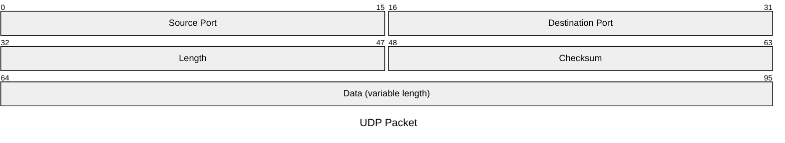
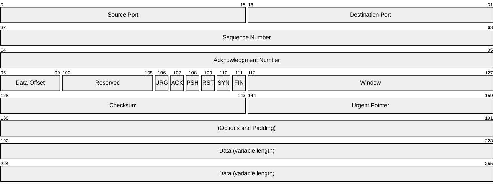

# Transportlaag

note:
- dient voor communicatie tussen *processen* op machines, niet gewoon tussen machines
- hier spreken we over "segmenten" voor datapakketjes
---
Poorten

note:
- zoals "postvakjes" op hetzelfde adres
- nodig voor zender ("outbox") en ontvanger ("inbox")
- een proces "luistert" naar een poort
---
- 0 tot 1023: "well-known"
- 1024 tot 49151: in principe voor vaste keuzes
- 49152 tot 65535: voor willekeurige toekenning
---
Voorbeelden:

- 22
- 80
- 443
- 3306
---
Sockets

note:
- unieke combinatie van **transportprotocol (TCP/UDP), IP-adres en poortnummer**
- eindpunt voor communicatie, zoals een stopcontact
- voor programmeurs: bytes in wegschrijven of bytes uit lezen
  - m.a.w. hier gaat de data van een applicatielaagprotocol in (of komt ze uit)
---
UDP

note:
- denkvraag: waarom 2 bytes voor poorten?

--- 

Wat is TTL?

---
- simpel
- snel
- "onbetrouwbaar"

note:
- UDP voegt eigenlijk enkel het concept van "poorten" toe aan IP.
- Pakketverlies of volgorde van ontvangst wordt niet geregeld.
- Dit protocol is vooral handig als er af en toe wat data verloren mag gaan of uit volgorde mag aankomen, maar weinig overhead gewenst is.
- Sommige netwerken blokkeren dit gewoonweg!
---
TCP

---
- complexer
- connectiegeoriënteerd
  - volgnummers
  - bevestiging ontvangst
  - start met een "handshake"
- nog steeds onderworpen aan fysica
- TLS zit hier meestal "bovenop"

note:
- connectiegeoriënteerd, maar nog steeds packet switching, geen circuit switching!
- **when in doubt, use TCP!**

---

Gebruik `npm run start` om de slides te starten;
surf naar http://127.0.0.1:8000 om dit te testen

Zoek je lokale IP-adress op (dat je wss via DHCP kreeg);
bezoek de slides via _dat_ IP-adress.

Ga naar 'whatismyip.com' en gebruik _dat_ om de slides te zien.
Werkt dit? Ook via je mobiele internet?

Probeer om dit ook via je mobiel internet aan de praat te krijgen!
Wss 'port forwarding' nodig

---

note:
port forwarding betekent dat alle binnenkomende IP-pakketjes voor een bepaalde poort,
worden doorgestuurd naar een specifiek apparaat in het netwerk (met IP-toekenning) naar een zelf te bepalen poortnummer
