```mermaid 
flowchart LR
WP[Wikipedia.org 185.15.59.224] <--> UPLINK
UPLINK{🌐} <--> A

A[<b>ROUTER</b> <br> Publiek ip: 78.23.104.174<br> intern IP: 192.168.178.2 <br>] <--> B[🖥️ 192.168.178.3]
A <--> C[🖥️ 192.168.178.4]
```

```mermaid 
flowchart LR
WP[Wikipedia.org 185.15.59.224] <--> UPLINK
UPLINK{🌐} <--> A

A[<b>ROUTER</b> <br> Publiek ip: 78.23.104.174<br> intern IP: 192.168.178.2 <br>] <--|✉️ @185.15.59.224:443;<br> from: 192.168.178.3:61432|--> B[🖥️ 192.168.178.3]
A <--> C[🖥️ 192.168.178.4]
```

```mermaid 
flowchart LR
WP[Wikipedia.org 185.15.59.224] <--> UPLINK
UPLINK{🌐} <--|✉️ @185.15.59.224:443;<br> from: <b>78.23.104.174:86935</b>|--> A

A[<b>ROUTER</b> <br> Publiek ip: 78.23.104.174<br> intern IP: 192.168.178.2 <br> <table><tr><th>ext port</th><th>send to</th></tr><tr><td>86935</td><td>192.168.178:61432</td></tr></table>] <--> B[🖥️ 192.168.178.3]
A <--> C[🖥️ 192.168.178.4]
```

# Transportlaag

---

note:
herhaling van osimodel

---

### Transportlaag?

note:
- dient voor communicatie tussen *processen* op machines, niet gewoon tussen machines
- hier spreken we over "segmenten" voor datapakketjes
---
### Poorten?

note:
- zoals "postvakjes" op hetzelfde adres
- nodig voor zender ("outbox") en ontvanger ("inbox")
- een proces "luistert" naar een poort
---
- 0 tot 1023: "well-known"
- 1024 tot 49151: in principe voor vaste keuzes
- 49152 tot 65535: voor willekeurige toekenning
---
Voorbeelden:

- 22
- 53
- 80
- 443
- 3306

Toegekend door IANA  
Zie [Wikipedia](https://en.wikipedia.org/wiki/List_of_TCP_and_UDP_port_numbers) voor meer

note:
- 22: ssh; 80: HTTP, 443: httpS, 3306: mysql; 53: DNS

---
Sockets

note:
- unieke combinatie van **transportprotocol (TCP/UDP), IP-adres en poortnummer**
- eindpunt voor communicatie, zoals een stopcontact
- voor programmeurs: bytes in wegschrijven of bytes uit lezen
  - m.a.w. hier gaat de data van een applicatielaagprotocol in (of komt ze uit)
---
UDP

note:
- denkvraag: waarom 2 bytes voor poorten?
- "I wanted to tell you a joke about UDP, but you might not get it"

---
- simpel
- snel
- "onbetrouwbaar"

note:
- UDP voegt eigenlijk enkel het concept van "poorten" toe aan IP.
- Pakketverlies of volgorde van ontvangst wordt niet geregeld.
- Dit protocol is vooral handig als er af en toe wat data verloren mag gaan of uit volgorde mag aankomen, maar weinig overhead gewenst is.
- Sommige netwerken blokkeren dit gewoonweg!

---
TCP

---
- complexer
- connectiegeoriënteerd
  - volgnummers
  - bevestiging ontvangst
  - start met een "handshake"
- nog steeds onderworpen aan fysica
- TLS zit hier meestal "bovenop"

note:
- connectiegeoriënteerd, maar nog steeds packet switching, geen circuit switching!
- **when in doubt, use TCP!**

---

---

## NAT (PAT)

note:
- Netwerkadresvertaling / Network Address Translation (NAT); PAT =  Port Adress Translation
- Vergelijk: ipconfig en myip.com
- (indien IPv4): zal voor iedereen **zelfde** zijn!
- Onderdeel NAT zit hier, want steunt op poorten om een de facto groter IP-adres te maken; maar past conceptueel beter bij 'netwerk'-laag

---

---

---

note:
- bestaan variaties op het concept, maar dit is wat je typisch moet weten als programmeur
  - sommige zaken moeten **eerst** de connectie opstarten (jij kan thuis niet zomaar als server werken)
  - poort die zichtbaar is aan ontvangerkant is niet noodzakelijk echte poort van de afzender
  - PAT doorbreekt protocolstapel (netwerklaag kijkt naar poorten van transportlaag)
    - nadeel: routers moeten details van TCP/UDP kennen, die protocols zijn wel dominant maar hindert andere zaken die bovenop IP staan
    - NAT/PAT doet al vrij lang goed dienst, maar is een "hack". Manuele port forwarding is soms nodig, nieuwe protocols bovenop IP implementeren is lastig.
    - truukje "hole punching" (en reden) moet je kennen voor applicaties
- Over terminologie: PAT (port address translation), NAT (network address translation), NPAT: network and port address translation
  - Allemaal hetzelfde in hedendaags gebruik. Zie https://en.wikipedia.org/wiki/Network_address_translation voor meer optionele info

---

# NAT != Firewall

note:
Door NAT toe te passen, worden veel binnenkomende pakketjes vanzelf gedropt en werkt dit als firewall
Wanneer we IPv6 (eindelijk) gaan beginnen gebruiken, gaan we rechtsstreeks online gaan en gaan we firewalls nodig hebben

---

# Hoe iets hosten achter NAT?

---

## Hoe iets hosten achter NAT?

- Hole punching
- Port forwarding

---

## Hole punching

O.a. gebruik bij P2P netwerken

1. Bittorrent op Computer A stuurt een boodschap naar een 'matchmaker'
2. Matchmaker noteert de gebruikte poort
3. Matchmaker geeft IP-address + poortnummer door aan peers
4. Inkomende messages van peers werken nu (hopelijks)

note:
- vaak niet stabiel

---

# Port forwarding

- Configuratie van de router
- Alle pakketjes voor poort &lt;N> worden doorgestuurd naar IP &lt;A.B.C.D>

note:
- administratierechten op router nodig
- router moet dit ondersteunen
- Sommige ISPs blokkeren dit

---

# Huiswerk

---

### Host iets van bij jullie thuis

1. Slides hosten op eigen PC
2. Slides via lokale netwerk bezoeken
3. Slides via het internet bezoeken
4. Port forwarding instellen

---

### 1. Slides hosten op PC

Doe `git clone` op de slides
Voer `npm ci` uit (eenmalig)

Gebruik `npm run start` om de slides te starten;
surf naar http://127.0.0.1:8000 om dit te testen

---

### 2. Via lokale netwerk

Zoek je lokale IP-adress op (dat je wss via DHCP kreeg);
bezoek de slides via _dat_ IP-adres.

_Noot: via Bletchley lukt dit ook, laat een student jouw slides testen_

---

### 3. Via publiek IP

Ga naar 'whatismyip.com' en gebruik _dat_ om de slides te zien.
Werkt dit? Ook via je mobiele internet?

Probeer om dit ook via je mobiel internet aan de praat te krijgen!
Wss 'port forwarding' nodig

---

#### 4. Port forwarding

note:
port forwarding betekent dat alle binnenkomende IP-pakketjes voor een bepaalde poort,
worden doorgestuurd naar een specifiek apparaat in het netwerk (met IP-toekenning) naar een zelf te bepalen poortnummer

---

## 5. Nieuw IP-adres

Kan je de slides bezoeken via mobiele data en je publieke IP-adress?

Super!

Herstart je _modem_/_router_ (het bakje van je ISP) (indien dit mogelijk is en niet teveel hinder geeft aan huisgenoten).

Wanneer je thuis terug internet hebt, werkt de website nog steeds?
Heb je nog steeds hetzelfde publieke IP-adres?

