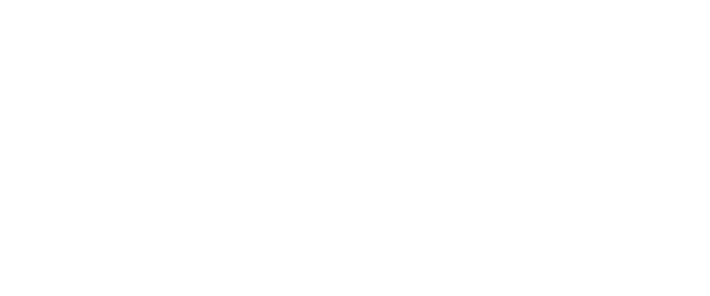

# HTTP(S)

note:
- hypertext transfer protocol (secure)
- "het protocol waarmee je surft"
- betekent niet dat het *enkel* daar voor dient
  - API calls
  - custom toepassingen, als HTTP een goede basis biedt
---
Wat is een applicatielaagprotocol?

note:
- uiteraard: een protocol
- mag veronderstellen dat routering volledig geregeld is (dus taak netwerklaag is afgerond)
- mag veronderstellen dat zendend en ontvangend proces aangeduid zijn (dus taak transportlaag)
---


note:
- clients komen en gaan, server moet online blijven
  - clients zijn dus vaak browsers
- server moet bereikbaar zijn (meestal toegang via naam die zelden wijzigt)
  - naam is in "basis"setup een alias voor een IP-adres
  - deze server is een "web server"
- verschillende versies van HTTP, niet allemaal zomaar te doorzoeken in Wireshark (nieuwer ⇒ meer beveiliging)
---
Demo PacketTracer

note:
- gebruik file `surfen.pkt` bij deze slides
- toon: server heeft IP
- activeer simulation mode
- probeer naar server te surfen
- onderzoek pakketjes om protocol en inhoud te tonen
- werk zo de request response cycle af
---
Verschillende versies

note:
- hangt af van zowel client (wat kent de browser?) als web server (wat ondersteunt die?)
- versie 1.0 komt niet meer voor
- 1.1 wel
- 2.0 ook
- 3.0 ook, is nog vrij nieuw
- [statistiek adoptie versie 3](https://w3techs.com/technologies/details/ce-http3)
---

note:
- laat zien hoe een web server een verzoek ontvangt (TCP payload)
- verklaar de rol van poortnummer
  - demonstratie: surfen naar www.ap.be, bekijk poortnummers
  - conventie, geen verplichting ⇒ zaken zoals `localhost:8080`
    - conventie bespaart uittypen van poortnummer voor elke site
  - 80 en 443 zijn "well-known", niet gebruikt voor andere zaken
---
<!-- .slide:data-background="#ffffff"-->


note:
- werking web server voor een **statische pagina**
- niet alleen gebruikt voor de HTML-pagina, maar ook voor de "embedded content"
- HTML-pagina's zijn dus niet de enige toepassing, gewoon de duidelijkste
---
<!-- .slide:data-background="#ffffff"-->


note:
- groen driehoekje is start TCP-verbinding (begin request)
- oranje driehoekje is einde TCP-verbinding (einde reply)
- "verbinding" is géén gereserveerde lijn, gewoon afspraak
- er wordt één TCP-verbinding gebruikt per cyclus
- "primitief" en traag, maar een goed startpunt
  - verbeteringen zijn aangebracht op basis van ervaring
  - surfen zou vandaag nog steeds sneller zijn dan vroeger als we met zelfde hardware werkten!
---
<!-- .slide:data-background="#ffffff"-->
<iframe width="560" height="315" src="https://www.youtube.com/embed/2QVxUuTHLus?si=Dyu0SaTvuZFiUlJI"
                        title="YouTube video player" frameborder="0"
                        allow="accelerometer; autoplay; clipboard-write; encrypted-media; gyroscope; picture-in-picture; web-share"
                        allowfullscreen />

note:
- "trage" voorbeeld = HTTP 1.1
- als de eerdere uitleg HTTP 1.0 is, hoe zou dat er dan uitzien?
- snellere voorbeeld is hier HTTP 2, 3 is nog sneller maar beperkt ondersteund
---
```text
Method spatie Path spatie Version\r\n 
Header veldnaam:waarde\r\n            
Header veldnaam:waarde\r\n            
Header veldnaam:waarde\r\n            
...                                   
Header veldnaam:waarde\r\n            
\r\n                                  
Data Data Data Data Data ...          
```

note:
- dit is de achterliggende structuur
- als er op MDN,... sprake is over headers,... gaat het over deze zaken
---
```text
GET /nl/faqs HTTP/1.1\r\n                 
Host: www.bpost.be \r\n                   
User-agent: Mozilla/5.0 Firefox/69.0 \r\n 
Connection: keep-alive \r\n               
Accept:text/html\r\n                      
```

note:
- concreter voorbeeld van de eerdere template
- dit is een *request*, een response zou er anders uitzien
- alles behalve de data is in ASCII
- headers zijn niet allemaal vereist
- een web server = een programma dat deze zaken uitleest, analyseert, een antwoord opbouwt in functie ervan
- dataveld is "free form"
- **vraag**: wat zou de gebruiker in zijn URL-balk hebben ingetypt?
- **vraag**: welke browser is hier gebruikt?
---
- GET
- POST
- PUT
- DELETE
- ...

note:
- komen niet allemaal voor in browserverkeer
- kan deze genereren met Postman / Thunder Client
- deze vier zijn te kennen, er zijn er meer
- PUT is de lastigste: een "upsert"
---
`curl -X METHOD URL -H "HEADERNAAM1: HEADERWAARDE1" -H "HEADERNAAM2: HEADERWAARDE2" ...`
note:

- voor als je HTTP wil automatiseren
- eigenlijk hetzelfde als `fetch` in NodeJS
  - wel veel kleiner en op veel meer machines beschikbaar
- Voorbeeld: `curl -X GET www.ap.be` (301: redirect, browser zou automatisch volgen)
---
- Open het Wireshark bestand `http1` van op DigitAP.
- Beantwoord volgende vragen:
  - Wat is het IP-adres van de **server**?
  - Naar welke serverpoort wordt er hier gestuurd?
  - Met welk protocol komt dit poortnummer overeen?
  - Welke versie van HTTP is er hier gebruikt?
  - Welke URL is er opgevraagd?
  - Welke HTTP method is er gebruikt?
  - Hoe veel headerlijnen zijn er hier in de request?
  - Hoe veel (niet-header) data?
---
```text
Versie spatie Code spatie Phrase\r\n 
Header veldnaam:waarde\r\n           
Header veldnaam:waarde\r\n           
Header veldnaam:waarde\r\n           
...                                  
Header veldnaam:waarde\r\n           
\r\n                                 
Data Data Data Data Data ...         

```
---
```text
HTTP/1.1 200 OK\r\n                               
Date: Fri, 27 sep 2019 09:29:38 GMT\r\n           
Server: Apache\r\n                                
Last-Modified: Wed, 25 sep 2019 21:58:55 GMT \r\n 
Content-Type:text/html\r\n                        
Content-Length:586\r\n                            
\r\n                                              
Data Data Data Data                               
```

note:
- een **response**, te herkennen aan gebruik van een foutcode
  - eerste cijfer moet je herkennen, de rest niet
  - 200 en 404 moet je wel op het zicht kunnen zeggen
- "Data" is bijvoorbeeld de HTML, maar wel voorgesteld als bytes
  - hoe die bytes begrepen moeten worden, kan mee in `Content-Type` header
- bekijk ook even het "network" tabblad in de browser (Firefox doet dit alvast goed): zelfde info, makkelijker leesbaar
- denkvraag: wat betekent dit voor iets zoals een website die de tussenstand van een sportwedstrijd of iets dergelijks toont?
---
- Beantwoord volgende vragen over het bestand `http2`:
  - Zorg dat enkel HTTP-pakketten zichtbaar zijn.
  - Welke URL werd bezocht?
  - Geef een lijst van de "embedded content".
  - Welke opgevraagde file kon niet gevonden worden?
  - Hoe kan je dit hier aflezen?
  - Ga op een HTTP pakketje staan, rechtsklik en kies voor “Follow” → "HTTP stream"
  - Wanneer is de homepage van de website voor de laatste keer aangepast?
  - Wanneer werd de website bezocht?
  - Welke font wordt er op de website gebruikt?
---
- Open [cheat sheet curl](https://devhints.io/curl)
- Start een trace in Wireshark.
- Doe met curl een POST request naar het pad `post` van de website `https://httpbin.org`. Geef met de `accept` aan dat het antwoordtype `application/json` moet zijn.
- Stop de trace.
- Filter enkel de pakketten die behoren tot deze interactie.
  - Tip: zoek er één dat tot deze interactie behoort en rechterklik...
- Kan je te weten komen welk type server heeft geantwoord?
---


note:
- TLS is tegenwoordig vereist
- sites als NeverSSL **moeten** oudere versie blijven gebruiken
- eigenlijk is SSL verouderd en vervangen door TLS, maar we gebruiken het nog als term (NeverSSL, SSL-certificaat,...)
---
```text
Versie spatie Code spatie Phrase\r\n 
Header veldnaam:waarde\r\n           
Header veldnaam:waarde\r\n           
Header veldnaam:waarde\r\n           
...                                  
Header veldnaam:waarde\r\n           
\r\n                                 
Data Data Data Data Data ...         
```

note:
- unencrypted
- mogelijk zichtbaar voor wie Wireshark runt op zelfde Wifi
- zichtbaar voor tussenstops tussen client en server
---
## HTTPS
---
- authenticatie
- encryptie
- HTTP protocol zelf blijft ongewijzigd
---
<!-- .slide:data-background="#ffffff"-->
<iframe width="560" height="315"
                        src="https://www.youtube.com/embed/j9QmMEWmcfo?si=uhMhe5eoUejHJaat&amp;start=66"
                        title="YouTube video player" frameborder="0"
                        allow="accelerometer; autoplay; clipboard-write; encrypted-media; gyroscope; picture-in-picture; web-share"
                        allowfullscreen />

note:

- probeer zo veel mogelijk te volgen (van start tot 3:47), ik zal de belangrijkste puntjes benoemen
  - er vindt een handshake plaats
  - server toont een certificaat, met daarin een public key, gegarandeerd door een vertrouwde partij (CA)
  - client kan dus iets terugzenden dat (volgens de vertrouwde partij) enkel bedoelde ontvanger kan lezen
  - op basis hiervan spreken ze een gedeeld geheim af (enkel zender en ontvanger kennen dit)
  - "self-signed certificate" is alleen zinvol voor testen, nooit vertrouwen (betekent dat server over zichzelf zegt dat hij betrouwbaar is)
  - oude beste practices blijven gelden, maar niet om exact dezelfde redenen
    - bv. geen wachtwoorden via `GET`
      - blijft nuttig omdat inkomende requests vaak gelogd worden, maar hun data niet
---

---
Certificaten

note:
- "bewijs van echtheid"
- van "DV" (domeinvalidatie) tot "EV" (extended validatie, inclusief soort background check)
- vooral belangrijk te onthouden:
  - bestaan voor volledig gespecifieerde domeinnamen of voor suffixen
  - LetsEncrypt is altijd mogelijk en is gratis, is dan ook het "bare minimum"
    - bewijst dat je communiceert met de eigenaar van die domeinnaam, maar bv. niet dat die domeinnaam eigendom is van bedrijf XYZ
  - demonstratie: "grote" websites geverifieerd door Google, Amazon, Microsoft,... ; blogs etc. vaak door Letsencrypt
---
TLS in Wireshark

note:
- enkel de "handshake" is normaal gesproken zichtbaar
- je kan voor je eigen traces wel extra info bijhouden ("secret key"), zodat je kan zien welk verkeer je stuurt
- bv. voor Examon kan je eigenlijk achterhalen welke data je naar de server stuurt
---
Statelessness

note:
- eenvoudiger ontwerp protocol
  - eenvoudiger te implementeren voor clientapplicaties zoals browsers en voor web servers
- minder feilbaar
- maar... strookt dit met de ervaring?
  - cookies
  - mechanismen voor local storage
  - database
---
Cookies

note:
- HTTP 1.0 lag vast in 1991, cookies in 1994!
- past binnen trend om voort te bouwen op eenvoudigere basis (bv. QUIC bovenop UDP)
- typisch 4 componenten
  - cookie header in de response ("hey, browser, onthoud dit voor deze website")
  - cookie header in request naar de website ("dit is wat ik moest onthouden")
  - cookie zelf (bestandje in de browser)
  - databasetabel (als de server iets moet onthouden)
---
<!-- .slide:data-background="#ffffff"-->

---
Nadelen

note:
- privacy (tracking cookies specifiek!)
- security (als bestandje dient als "polsbandje" voor login, kan het mogelijk gestolen worden)
---
Moraal

note:
- wees voorzichtig met gebruik van cookies en informeer je rond best practices security, mogelijk specifiek voor je web framework!
---
Local storage en IndexedDB

note:
- doen wat aan cookies denken
- ander toepassingsgebied: dienen voor gebruik met JavaScript
---
### Opdrachten
---
Zoekopdracht:

- session cookie
- persistent cookie
- first-party cookie
- third-party cookie
- zombie cookie
- tracking cookie
---
www.ap.be

note:
- Welke cookies worden ingesteld?
- Hoe kan je dit zien?
---
amiunique.org

note:
- Vorm van tracking **zonder** cookies, "browser fingerprinting"
---
<!-- .slide:data-background="#E5F3FE"-->

---
(HTTP) proxy

note:
- "goede" man in the middle
- bespaart bandbreedte
- kan extra beveiliging toevoegen
- kan surfgedrag werknemers beperken / monitoren
- kan met TLS werken, maar vereist extra certificaat (waardoor eigenaar proxy *al* je verkeer kan monitoren, in principe zelfs als je niet meer via de proxy surft maar wel het certificaat behoudt)
- verwant aan een VPN, maar focus ligt op caching i.p.v. verbeteren privacy
- soms beperkt tot HTTP, soms voor alle soorten verkeer
- lijstje: https://www.fortinet.com/resources/cyberglossary/proxy-server
---
<!-- .slide:data-background="#FEFDDE"-->


note:
- eenvoudige proxy voor security doeleinden
- surf naar neverssl.com
- bewerk opgezochte pagina, bewerk antwoord
- kan geautomatiseerd
- kan dus ook met TLS
---
<!-- .slide:data-background="#FFF"-->

---
- installeer mitmproxy (mogelijk expliciet toelaten)
- run in terminal: `mitmproxy`
- run in tweede terminal: `curl --proxy localhost:8080 neverssl.com`
- wat zie je gebeuren?
- stop hierna het commando `mitmproxy` met de `q`-toets
---
- bekijk het tutorialfilmpje op [deze pagina](https://docs.mitmproxy.org/stable/mitmproxytutorial-interceptrequests/)
- start het commando `mitmweb` (de grafische versie)
- Stel via "start" → "intercept" een filter in die responses tegenhoudt
- Navigeer met <code>curl</code> naar http://wttr.in/Antwerpen
- Ga na dat je het request ziet in MITMWeb
- Pas het weerbericht aan dat de ontvanger te zien krijgt
- Laat het gewijzigde antwoord versturen
- Zie je het aangepaste weerbericht in de terminal?
---
**reverse** proxy

note:
- past **inkomend** verkeer aan eerder dan uitgaand 
- kan gebruikt worden om aparte web servers op zelfde machine te runnen
- kan gebruikt worden om HTTPS te voorzien wanneer de web servers dit zelf niet ingebouwd hebben
- je zal er zo eentje voorzien voor je projectopdracht
- **veronderstel in code niet dat je rechtstreeks met de andere partij spreekt!**
---
- Lees [deze pagina](https://docs.mitmproxy.org/stable/concepts-modes/#reverse-proxy) tot en met "Listen port"
- Zorg dat HTTP-verkeer naar localhost:8080 wordt omgeleid naar neverssl.com via de terminalversie van `mitmproxy`
- Configureer de reverse proxy om requests te onderscheppen.
- Stuur een request naar localhost:8080 met curl (zonder `--proxy` in het commando!).
- Zie je iets in je MITM venster?
- Wat gebeurt er als je rechtstreeks naar http://neverssl.com gaat met curl?
  - (Met je browser zie je dit niet altijd omwille van caching.)

