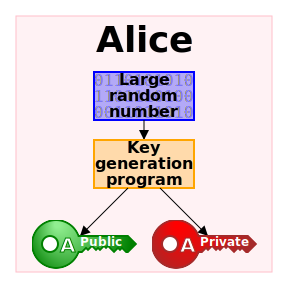
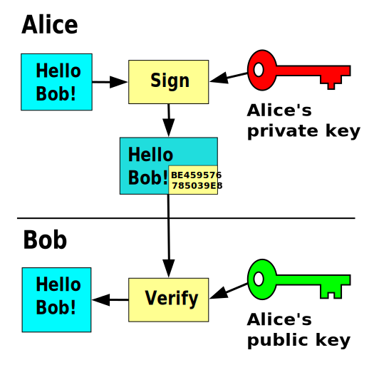
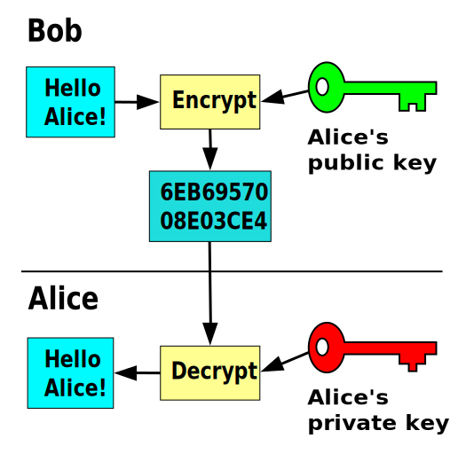
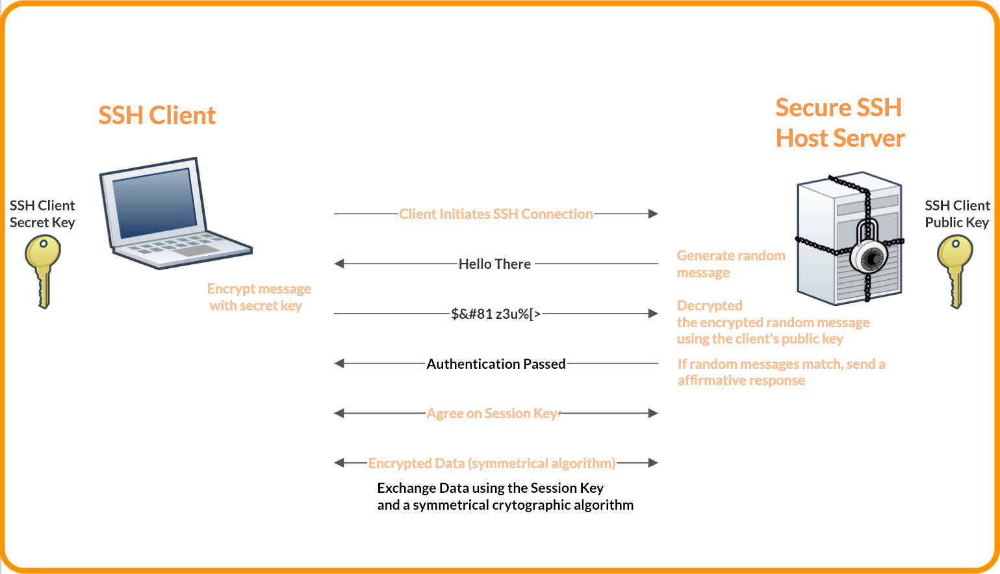

# SSH

note:
- secure shell (remote login)
- vereist client en server
- applicatielaagprotocol
- standaard luistert server op poort 22
- client is voorzien bij Git Bash (op windows)
- vaak niet mogelijk via wachtwoord, wel asymmetrische sleutels - afhankelijk van instelling SSH-server
- klassiek gebruik = shell opstarten
- maar ook voor Github, voor remote sessie VSC,...
- alomtegenwoordig in cloud infrastructuur!
  
---

note:
- dit wordt gemaakt met hele coole maar moeilijke wiskunde
- er zijn een aantal algoritmes (zoals elliptic curve, of met priemgetallen RSA, AES)

---

note:
- Wordt ook gebruikt bij certificaten van HTTPS en encryptie HTTPS om te _valideren_
- Eventuele zijsprong: digipass met bankkaart qua werking (al is dit technisch niet correct want symmetrische encryptie!)
- Eventuele zijsprong: bitcoin wallets
  

---

note:
- maar hier in de andere richting, om te _encrypteren_
- inzichtsvraag: wat is het verschil tussen beide diagrammen?
- (sleutels zijn omgedraaid. Geen fundamenteel verschil tussen het publieke en private deel voor het algoritme, wel in manier van omgang. Private sleutel verlaat nooit het toestel, publieke sleutel mag door de hele wereld gekend zijn)

---

---

Opdracht:

- Kijk in je home directory, in de map `.ssh`. Bestaat deze? (Zoniet: maak ze).
- Staat hier reeds een `.pub` bestand in? Bekijk dit met een tekst-editor. Dit is je **publieke sleutel**
- Er is een overeenkomstig bestand _zonder_ extensie. Bekijk deze; dit is je private sleutel.
- Bestaat dit nog niet? Maak een sleutelpaar met `ssh-keygen -t rsa` met defaults en lege passphrase
- kijk in (verborgen map) `.ssh`

---

Met je publieke sleutel kan je je toegang tot (o.a.) github automatiseren.

- Ga naar je github-instellingen en kijk waar je een SSH-sleutel kan toevoegen
- Test daarna de connectie met `ssh git@github.com`
- Lees aandachtig wat er op het scherm verschijnt. Is het aanmelden gelukt?
- Bekijk welk stukje tekst je aan `git clone` moet geven om met SSH een repo te clonen. Welke onderdelen herken je?
- Clone nu een repo met SSH (eventueel maak je een nieuwe repo aan)
- Test `git push`. Moet je je nog aanmelden? 

---

# Inloggen op een linux-machine

---

## Met username en wachtwoord

`ssh [username@]computernaam [-p <poortnummer>]`

Bijvoorbeeld:

`ssh pietervdvn@10.20.30.40`
`ssh root@example.org -p 2222`

- Geen poortnummer gegeven? Default is *22*
- Geen username? Gebruikt username waarmee je op je computer bent aangemeld
- Je mag ofwel een IP-adres, ofwel een DNS-naam gebruiken

note:
- Waarom een andere poort gebruiken? Zet bots die het internet afspeuren op het foute been. Klein beetje extra security - maar niet veel

---

## Eerste flow

- Wanneer je voor het eerst verbindt, zal de SSH-client je de _fingerprint_ tonen van de server
- Bevestig dat je deze vertrouwt
- Je wachtwoord wordt gevraagd

Waarom toch nog een wachtwoord gevraagd? We maakten toch een publieke/private sleutel?

note:
- De fingerprint is gebaseerd op de publieke sleutel van de server. Indien deze plots veranderd, heb je wss een man in the middle
- Je hoort deze vingerafdruk _out of band_ na te kijken, bv door aan de sysadmin te vragen of deze vingerafdruk klopt of via rechtstreekse connectie die te bekijken.
  - Dit gebeurt vaak niet, maar wél nodig voor kritieke infrastructuur!
- Je publieke sleutel is nog niet gekend door de server, je kan hier dus nog niet mee aanmelden

---

authorized_keys

note:
- zit op de server!
- betreft dus publieke sleutels!
---
known_hosts

note:
- op de client!
- omvat adres en signatuur
- waarschuwing bij nieuwe bestemming
  - waarom denk je dat dit belangrijk is?
---

Indien de lesgever géén SSH-server ter beschikking stelt, maken we zelf een Linux-machine waarop dit kan:

Opdracht:
- installeer VM met [Debian netinstall](https://www.debian.org/CD/netinst/)
  - activeer tijdens installatie "SSH server"
- [schakel port forward in](https://apwt.gitbook.io/g_pro-cloudsystemen/applicatielaag/ssh)
- noteer usernaam en wachtwoord tijdens installatie
- log in met wachtwoord
---

- kopieer naar server: `ssh-copy-id -i ~/.ssh/id_rsa.pub username@remotehost`
  - dit combineert `scp` met een append in `.ssh/authorized_keys`
- log in op de server
- `chmod 700 ~/.ssh` beperkt rechten op deze map
- `chmod 600 ~/.ssh/authorized_keys` beperkt rechten file
- test login zonder wachtwoord

---
config

note:
- meerdere SSH key pairs mogelijk
- kan default settings koppelen
  - bv. deze sleutel gebruiken wanneer we met dat IP-adres verbinden
  - te veel verschillende sleutels en geen config ⇒ te veel pogingen, weigering
---
- `scp /path/to/local/file username@remotehost:/path/to/remote/directory`
- `scp username@remotehost:/path/to/remote/file /path/to/local/directory`

note:
- Op Linux begint een filesysteem bij `/`, niet `C:`
- forward slash ipv backslash
---
Opdracht:
- kopieer een file naar keuze van je lokaal systeem naar de VM met SCP
- controleer (via `cd`, `ls` en `cat`) dat de file er staat en de juiste inhoud bevat
