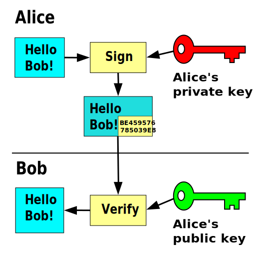

# SSH

note:
- secure shell (remote login)
- vereist client en server
- applicatielaagprotocol
- standaard luistert server op poort 22
- client is voorzien bij Git Bash (op windows)
- vaak niet mogelijk via wachtwoord, wel asymmetrische sleutels - afhankelijk van instelling SSH-server
- klassiek gebruik = shell opstarten
- maar ook voor Github, voor remote sessie VSC,...
- alomtegenwoordig in cloud infrastructuur!
  
---

note:
- dit wordt gemaakt met hele coole maar moeilijke wiskunde
- er zijn een aantal algoritmes (zoals elliptic curve, of met priemgetallen RSA, AES)

---

note:
- Wordt ook gebruikt bij certificaten van HTTPS en encryptie HTTPS om te _valideren_
- Eventuele zijsprong: digipass met bankkaart qua werking (al is dit technisch niet correct want symmetrische encryptie!)
- Eventuele zijsprong: bitcoin wallets
  

---

note:
- maar hier in de andere richting, om te _encrypteren_
- inzichtsvraag: wat is het verschil tussen beide diagrammen?
- (sleutels zijn omgedraaid. Geen fundamenteel verschil tussen het publieke en private deel voor het algoritme, wel in manier van omgang. Private sleutel verlaat nooit het toestel, publieke sleutel mag door de hele wereld gekend zijn)

---

note:
- zullen iets verderop zelf sleutels maken!
---
authorized_keys

note:
- zit op de server!
- betreft dus publieke sleutels!
---
known_hosts

note:
- op de client!
- omvat adres en signatuur
- waarschuwing bij nieuwe bestemming
  - waarom denk je dat dit belangrijk is?
---
Opdracht:
- installeer VM met [Debian netinstall](https://www.debian.org/CD/netinst/)
  - activeer tijdens installatie "SSH server"
- [schakel port forward in](https://apwt.gitbook.io/g_pro-cloudsystemen/applicatielaag/ssh)
- noteer usernaam en wachtwoord tijdens installatie
- log in met wachtwoord
---
Opdracht:
- sleutelpaar aanmaken: `ssh-keygen -t rsa` met defaults en lege passphrase
- kijk in (verborgen map) `.ssh`
- kopieer naar server: `ssh-copy-id -i ~/.ssh/id_rsa.pub username@remotehost`
  - dit combineert `scp` met een append in `authorized_keys`
- log in op de server
- `chmod 700 ~/.ssh` beperkt rechten op deze map
- `chmod 600 ~/.ssh/authorized_keys` beperkt rechten file
- test login zonder wachtwoord
---
Opdracht:
- registreer je (publieke!) sleutel op je Github account
- clone een publieke repository met het SSH-protocol (niet met HTTPS)
---
config

note:
- meerdere SSH key pairs mogelijk
- kan default settings koppelen
  - bv. deze sleutel gebruiken wanneer we met dat IP-adres verbinden
  - te veel verschillende sleutels en geen config ⇒ te veel pogingen, weigering
---
- `scp /path/to/local/file username@remotehost:/path/to/remote/directory`
- `scp username@remotehost:/path/to/remote/file /path/to/local/directory`

note:
- Op Linux begint een filesysteem bij `/`, niet `C:`
- forward slash ipv backslash
---
Opdracht:
- kopieer een file naar keuze van je lokaal systeem naar de VM met SCP
- controleer (via `cd`, `ls` en `cat`) dat de file er staat en de juiste inhoud bevat
