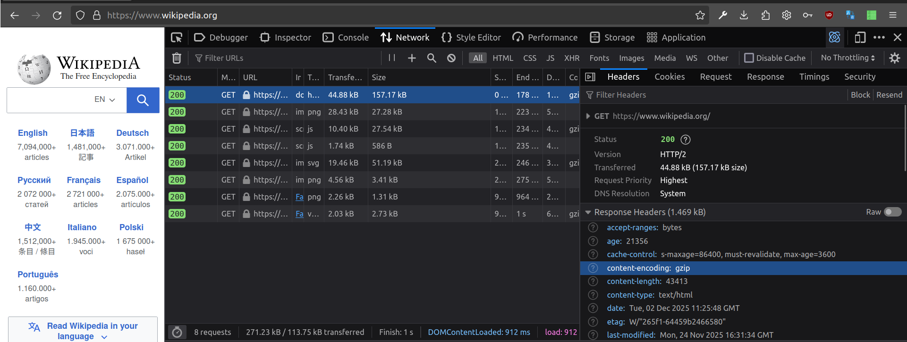

 # Reverse proxy service
 
---

### Wat is een reverse proxy?

---


### Wat is een reverse proxy?


note:
Een reverse proxy is een _proces_ dat de requests van het internet ontvangt en doorstuurt naar de juiste achterliggende service(s).

De achterliggende services zijn netwerkservices, mogelijks op een _andere_ server.

---

### Waarom een reverse proxy?

---

### Waarom een reverse proxy?

- Veiligheid
- Stabiliteit
- TLS


---

### Veiligheid

- Goed getest stuk software, kan tegen gekke pakketjes
- Ingebouwde functionaliteit voor IP-blocklists

---

### Stabiliteit

- Load balancing
- Automatische error-message indien de service zélf kapot is

Note:
load balancing is als je verschillende, identieke services naast elkaar runt. Je kan de aanvragen dan over verschillende machines verdelen. Als er eentje defect is of volop bezig, spring de andere bij.
Vooral nuttig voor "alleen-lezen"-websites

---

### Performance

- Cache-handling
- Toevoegen van _compressie_ aan HTTP
- Gebruik van HTTP3, ook als je software enkel HTTP2 ondersteunt

note:
Je HTTP-antwoord kan met ZIP of BROTLI gecomprimeerd worden.
Dat is een heel gedoe om toe te voegen aan je applicatie (niet elke taal heeft een bibliotheek voor Brotli)
Met caddy is dat een regeltje aan de config toevoegen

---

### In de praktijk

Welke compressie gebruikt https://mapcomplete.org?
Welke compressie gebruikt https://wikipedia.org?

notes:
Tot mijn grote schaamte: geen. Dit is kapot 

---



notes:
Transferred size is véél kleiner dan actual size
content-encoding: gzip
dus ZIP-compressie

---

### Gebruiksgemak

- Makkelijke interface om bv HTTP-headers te tweaken (bv: cache-control header)
- Makkelijk enkele bestanden online zwieren

Note:
het grote voordeel is dat de applicatie zelf niet alle details over HTTP moet kennen, en dat wijzigen van headers geen herstart van de applicatie nodig heeft, enkel van de reverse proxy


---

### TLS


- Volledig automatisch!

note:

Voor wat staat TLS ook alweer? -> Transport layer security
Ook bij een service als Let's encrypt moet je kritisch zijn. Jullie moeten in jullie project enkele vragen hierover beantwoorden!

---

### Hoe zat dat ook alweer? 

- Welke poort voor HTTP(S)?
- Hoeveel IP-addressen waren er ook alweer wereldwijd?
- Hoeveel websites zijn er online?

notes:
IP-addressen (v4): 4 bytes, dus 32 bits, 2^32 mogelijke IP-addressen, 4'294'967'296, ~ 4 miljard
Ongeveer 1.4 miljard geregistrerede domeinen (bron: https://siteefy.com/how-many-websites-are-there/)
-> grote nood aan hergebruik van IP-addressen!
	"Huur" van een IPv4-adres is €0.5/maand bij Hetzner
---

### Domein-gebaseerde proxying

Requests doorschakelen naar een andere service (aka website) op basis van domeinnaam


---


### In de praktijk

Wat is het IP-adres van
- mapcomplete.org
- report.mapcomplete.org
- source.mapcomplete.org

notes:
eigenlijk is dit herhaling van voorgaande lessen
de eerste twee: zelfde host, reverse proxy (caddy) schakelt naar juiste service op basis van domeinnaam
twee: verschillende host. Niets te maken met reverse proxy, fysiek(*) andere machine
	(*) of misschien stiekem toch dezelfde hardware?

---

# Welke software

---

### Bestaande reverse-proxies

- Traefik
- Caddy
- NGinx
- Apache Traffic server
- Squid
- ...

notes:
Er is verschil in features, i.e. niet elke software heeft elke feature

---

# Caddy

note: 
waarom caddy? De lesgever is hiermee vertrouwd + veel features + goeie docs + open source (apache license)

---


#### Rechtstreeks

Zie https://caddyserver.com/docs/install


#### Met docker

`docker run --rm -p 80:80 caddy`

notes:
De `--rm` verwijdert de container wanneer deze wordt gestopt, automatische opkuis dus!


---

### Configuratie

Een `Caddyfile` beschrijft de services

---

### Configuratie: bestanden hosten


```
mapcomplete.org, www.mapcomplete.org {
	root /root/public/master/
	file_server
}
```

note:
het absolute minimum
eerste lijn: één of meerdere domeinnamen. Alles voor deze domeinnaam wordt door dit blok afgehandeld
In het blok:
- `root /root/public/master` instellen van welke map er gehost wordt
- `file_server`: dit is de hoofddirective; dit zegt dat er bestanden van de harde schijf gehost moeten worden


---

### Configuratie: bestand hosten ++

```
mapcomplete.org, www.mapcomplete.org {
	root /root/public/master/
	encode
	try_files {path}.html
	file_server
	header {
		+Permissions-Policy "interest-cohort=()"
	}
}

```

notes:
eerste lijn: één of meerdere domeinnamen. Alles voor deze domeinnaam wordt door dit blok afgehandeld
In het blok:
- `encode`: gebruik compressie. Verhaaltjestijd: mijn applicatie is nogal zwaar (voor een website): 
- `header-block`: voegt HTTP-headers toe, bv. om CORS, cache-control, ... in te stellen


---

### Reverse proxy

```
report.mapcomplete.org {
	reverse_proxy http://127.0.0.1:2348
}

```

Note:
requests die binnenkomen voor `report.mapcomplete.org` worden gelezen, herverpakt als http (_zonder_ TLS) en doorgestuurd naar poort 2348

Ook hier zou men headers, ... aan kunnen toevoegen


---

### TLS

Caddy regelt TLS **volledig zelf**, mits:
 - de caddyfile **vermeld de domeinnaam (of domeinnamen)** 
 - poort 80 én 443 zijn bereikbaar via het internet

Dit is via het [ACME-protocol](https://en.wikipedia.org/wiki/Automatic_Certificate_Management_Environment)
 
notes:

Het proces in een notendop:
1. Caddy vraagt aan _Let's encrypt_ (of een andere certificate authority) een certificaat voor `example.org`
2. De CA zoekt IP-adres op
3. De CA stuurt een _challenge_ naar dit IP-adres
4. Caddy beantwoord de challenge door deze ondertekend terug te sturen
5. De CA geeft je een certificaat

	

---

### Zelf caddyfile maken: part 1

- Maak een caddyfile in, host enkele _files_
- Schakel de `browse`-directive in. Wat doet deze directive?
- Start caddy. Indien via docker -> zoek zelf op in de documentatie welke mappen je moet binden om de caddyfile op de juiste plaats te krijgen
- Test of je de files van een buur kan bezoeken
	(Mogelijks enkel op Bletchley of hotspot mogelijk, wss niet)
	
---

### Zelf een caddyfile maken: part 2

- Zet 'compressie' aan, test in je browser of dit ook werkt
- Gebruik 'precompressed', maak eerst '.br' (`apt install brotli`) en `.gz` bestanden
- Fix de compressie van MapComplete, [open een PR voor de config](https://source.mapcomplete.org/MapComplete/MapComplete/src/commit/17ab3dafe61dff968482f0fa8d4a00a13b0cd083/Docs/ServerConfig/hetzner/Caddyfile#L30) (optioneel, moeilijk)
- Zet de 'cache-control' aan zodat je browser caching gaat doen

---

### Zelf caddyfile maken: part 3

- Pas je caddyfile aan. Het pad `/express/` moet naar je express-app gaan, het pad `/files/` is de fileserver van daarnet
	_We zagen geen matcher in de theorie. Zoek dit zelf uit met behulp van [de documentatie](https://caddyserver.com/docs/caddyfile/matchers). Gebruik géén chatGPT voor deze opdracht_
	
	
note:
Documentatie zoeken, lezen en gebruiken is een belangrijke vaardigheid. Het moet niet altijd voorgekauwd zijn!

---

### Zelf caddy deployen: part 1 (project)

- Log in via SSH op je server voor je project
- Maak er een caddyfile
- Start caddy op (via docker)
- Test of `http://<jouw ip-adres>/<jouw bestand>` een resultaat geeft. 

---

### Zelf caddy deployen: part 2 (project)

- Configureer een (Dyn)DNS voor je server
	Self-hosters van thuis uit: gebruik een cronjob om automatisch je IP up te daten! Zie `crontab -e`
- Configureer je domein in je caddyfile
- Test of `https://<jouw-domein>` werkt


---

### Meer info, bronnen

[Officiële caddy documentatie](https://caddyserver.com/docs/getting-started)


