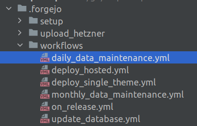
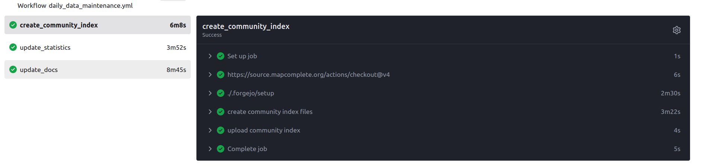

CI/CD

---

Je hebt net een coole feature gemaakt

Hoe raakt dit in productie?

---

### Optie 1: handmatig

Je connecteert via SSH met de server, doet een git pull en deployed

note:

- kost veel tijd
- veel kans op fouten
- hoe zit 't met je automatische testeb?

---

### Optie 2: scheduled releases

Je wacht. Het bedrijf waarin je werkt maakt elk halfjaar een nieuwe versie


note:

- dit is eerder zeldzaam geworden, maar werd vroeger gebruikt wanneer een nieuwe versie van de CD (!) gedistribueerd werd
- sommige OS doen dit nog, bv "Ubuntu", waar het versienummer (bv: 25.10) verwijst naar het jaar (2025) en de maand (oktober)
	+ Nog steeds backports voor dringende bugfixes via het internet!
- Dit soort release cycles hebben ook typisch een 'codefreeze' aka 'integratieperiode' om te testen

---

### Optie 3

# CI/CD

notes:
- staat voor _Continuous Integration/Continuous Deployment_

---
Pipeline


note:

- de "integration" slaat op het testen en samenbrengen van de verschillende stukken software
	- samenbrengen is bv de dependencies installeren
	- testen: automatische unit tests, maar bv ook of de laatste versie van een dependency niets kapot maakt
- de "delivery" is bv het maken en beschikbaar maken van artefacts (zoals binaries, logs)
	+ eerder voor software die men downloadt
- de "deployment" is het _uitrollen_ van de software,
	+ bv op de webserver
	
---

### Voordelen

- Automatisch, dus goedkoop want geen devtijd meer nodig
- Fixes en features vloeien sneller door
- Korte feedbackloop naar gebruikers
- Je kan ook branches en PRs automatisch bouwen én deployen
	- Testwebsite met nieuwste features kan online beschikbaar gesteld worden voor een testpubliek
	
---

### Wanneer géén CI/CD?

Als de kost van het updaten erg hoog is

Bv: besturingssysteem of programmeertaal

---

### Nadelen

- Kost wat tijd op te zetten
	+ Maar dit is slechts een fractie van wat je ermee uitspaart
- Je moet een buildserver opzetten
	+ Computers zijn vandaag vrij goedkoop
	+ Of waarom er een computer met 256GB RAM in mijn kelder staat (*)
	+ een _cloud_computer huren kan wel oplopen in kost!
	
	
note:

Wel, in de eerste plaats om de planet file te kunnen verwerken. Maar de CI/CD is een leuke bonus!
Soms kan je op ebay koopjes doen (mijn server: 256GB RAM + 6TB HDD = €300)

---


# Hoe?


---

### Git hooks

= Scriptjes met vaste namen in de map `.git/hooks`

note:
https://githooks.com

- pre-commit (kan via exit code commit tegenhouden)
- post-commit
- pre-receive (ook via exit code, maar voor accepteren push)
- post-receive (bv: email uitsturen)


staan (omwille van locatie) <strong>standaard niet</strong> in versiebeheer en dus ook niet gelinkt aan branches
kunnen in allerlei scriptingtalen geschreven zijn (Bash, PowerShell, Python, PHP,...)
kunnen op developermachines staan (dus lokaal), maar ook op remotes
Worden minder gebruikt door de opkomst van 'actions'


---

# Actions

---

Worden door de _forge_ uitgevoerd, op de server

note:
een _forge_ (letterlijk: smeltkroes, smidse) is een website waar men _samen_ aan software werkt

Meest bekende voorbeeld is github

---

### Software-specifiek

Door de _forge_ uitegevoerd -> specifiek voor welke serversoftware je gebruikt

Bv: github gebruikt "Github actions"-bestanden met hun specificatie, deze staan in `.github/workflows`

Github biedt ook gratis rekenkracht aan voor Open-source projecten

note:

niets in het leven is gratis. Waar zit het verdienmodel?

---

### Software-specifiek

Specifieke spec en gratis rekenkracht?

Dit ruikt naar lock-in!

_enter gitea_

---

### Gitea aka Forgejo aka Forgejo

Open-Source alternatief voor Github


- Gitea is het oorspronkelijke pakket
- Werd geforked onder de naam _Forgejo_
- Codeberg e.V. is de VZW die _Forgejo_ ontwikkeld
- Codeberg.org is hun gehoste versie

---

### Waarom een selfhosted versie?

- Onafhankelijk van VS
- Werkt beter (!) dan Github: sneller, minder bloat...
- ... maar een schaamteloze kopie: alles staat op de gekende plaats
- spam is ietwat een probleem (maar: OAUth met externe provider lost dit op)

Kan je zélf hosten
note:
- source.mapcomplete.org is een seflhosted forgejo, login met OSM-account
- er is ook nog Gitlab, maar die gebruik ik niet graag

--- 

### En hoe zit het nu met die actions?

_Ook_ een schaamteloze kloon, een _Github-actions_ werkt (meestal) out of the box
Codeberg.org biedt zelf (gelimiteerde) runners aan


---

# Actions

---

Eerst aanzetten in `settings`

---

Elke actie wordt beschreven in een yaml-bestand.

Deze staan in `.github/workflows/` of `.forgejo/workflows/`



note:
Forgejo gaat _ook_ .github/workflows bekijken

---

Een actie kan bestaan uit verschillende _jobs_


---

Via de webinterface kan je de status van de actions zien



---

### Syntax


Eerste blok: _wanneer_ wordt dit uitgevoerd?

```
on:
  push: # op elke push naar de repo
  workflow_dispatch: # er is een extra knopje in de webinterface om te starten
  pull_request: # wanneer er een pull request binnenkomt
  schedule: # op vaste tijdstippen
    - cron: "0 2 * * *"
```

Je kan afzetten wat je niet nodig hebt

note:

met iets als 
```
  push:
    branches-ignore:
      - build/*
```

zal _niet_ triggeren op branches die beginnen met build/

---

### Syntax

Tweede blok: _jobs_

_Wat_ moet er uitgevoerd worden?

```
jobs:
  <naam>:
    runs-on: [ <tags van runner, bv ubuntu-latest> ]
    steps:
      - uses: actions/checkout@v4 # moet er altijd staan, clone de repo
      
      - name: <name>
        run: ... bash ...

```

Typische stappen: installatie dependencies, testen, bouwen, overzetten naar productie-omgeving

---

### Artifact

> [An artifact is one of many kinds of tangible by-products produced during the development of software.](https://en.wikipedia.org/wiki/Artifact_(software_development))

Een ding dat je bouwt en dat _bewaard_ moet blijven na de action

Ideaal voor bv. een zip met alle source-files in, een APK, exe, ...
Je uploadt die bij je "release". Je docker compose kan dan regelmatig checken op updates

https://forgejo.org/docs/latest/user/actions/advanced-features/#artifacts


note:
schrijft met een I (in het Engels), geen e (wel in het Nederlands)

---

### Documentatie


Forgejo heeft uitstekende documentatie:

https://forgejo.org/docs/latest/user/actions/basic-concepts/


---


# Oefening

1. Maak een account op codeberg.org (OF: maak een account op OpenStreetMap.org en gebruik die om je aan te melden bij  source.mapcomplete.org)
2. Maak een nieuwe repo
3. Zet je express-applicatie erin
4. Maak tests die uitvoeren met `npm run test` (hoeft niet _echt_ te testen)
5. Maak een workflow die de volgende steps heeft:
	a. `npm ci` om de deps te installeren
	b. `npm run test` om de tests uit te voeren

---

# Goed om te weten

---

### Version drift

De workflow-files zitten in de versiecontrole

-> Mogelijks verschillende versies afhankelijk van de branch!

---

### Externe acties

Je kan ook acties gebruiken die in andere git-repo's staan

Vaak erg nuttig, maar wel een niet-vertrouwde dependency, kan zomaar aangepast worden

note:
extra reading: https://nesbitt.io/2025/12/06/github-actions-package-manager.html


---

### Secrets

Het wachtwoord van een digitale sleutel, een SSH-wachtwoord of NPM-wachtwoord kan met een 'secret'

Dit werkt als een omgevingsvariable maar kan niet via de webinterface bekeken worden

Zie https://forgejo.org/docs/next/user/actions/security/#secrets


---

### Oefening

1. Hoe worden builds van source.mapcomplete.org/mapcomplete/mapcomplete gedeployed (deploy_hosted)?
2. Hoe veilig is dit?

---

### Je eigen, selfhosted runner

Zie https://docs.codeberg.org/ci/actions/

---

### Veiligheid

Je actie en je secrets worden gestuurd naar een _runner_. Deze runner kan dus je secrets zien.

Een actie die door een pull-request getriggerd wordt, is potentieel aangepast door een aanvaller.
Deze kan dus _secrets_ exfiltreren. 

Recent (3 weken) geleden: grote supply chain attack op NPM via GH acties
	Worm in NPM...
	Installeert 'Github Runner' op de developer machine en voert daar code uit...

note:
https://blog.gitguardian.com/shai-hulud-2/
https://forgejo.org/docs/next/user/actions/security-pull-request/

---

### Veiligheid pt 2

Host je zelf je runner? 

De arbitraire code zou op de runner kunnen gaan rondneuzen...

-> Forgejo loopt normaalgezien de runners in een Docker of LXC-container voor isolatie

---

### Veiligheid: officiele aanbevelingen

Runner

>    Container runners are generally safe, but they may be compromised if misconfigured.
>    Never trust a host runner if it is shared with other users.
>    The safest option is to host your own runner, and use it only for your trusted repositories.

Secrets

>    Use the secrets feature to store API tokens and passwords for use in workflows.
>    Do not print secrets to output, as these may be publicly visible.


---

### Services

Je kan een "service" als docker container opzetten, bv een databank om tegen te testen

Zie https://forgejo.org/docs/latest/user/actions/advanced-features/#services


