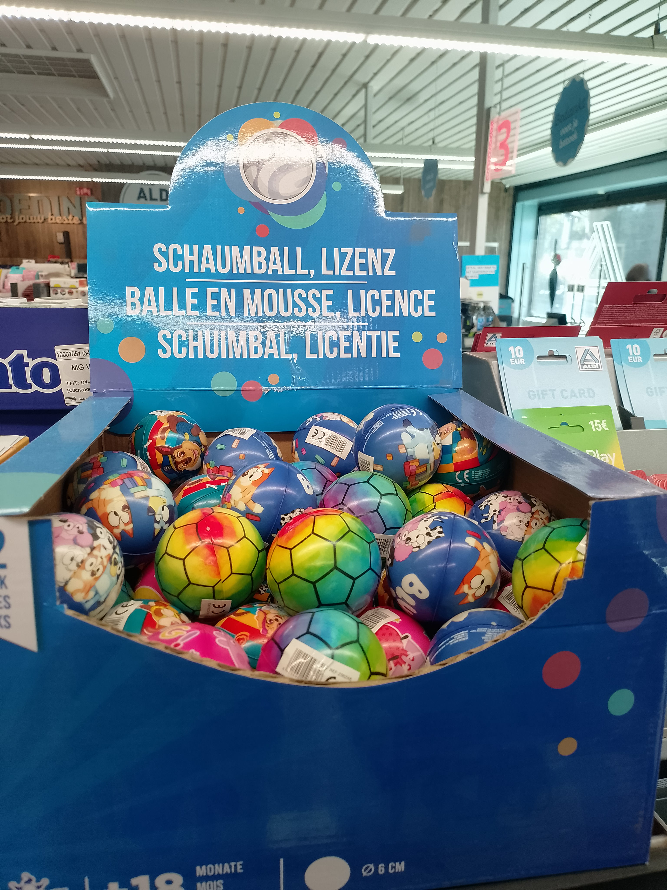
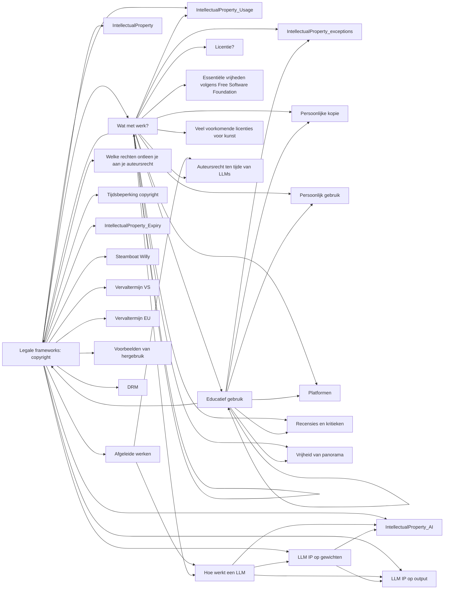

# Legale frameworks: copyright

note: 
https://nl.wikipedia.org/wiki/Databankenrecht
https://nl.wikipedia.org/wiki/Copyright
https://www.intellectueeleigendom.be/kennisbank/wat-zijn-de-regels-rondom-auteursrecht/
---

## Mag je op je website het volgende zetten?

- Een zelfgemaaktefoto van hat standbeeld in het park
- Een quote uit het boek "Harry Potter"
- Een leuke afbeelding op het internet
- Een screenshot van Google Maps
- Alle locaties van alle winkels; je zocht die op op Google Maps
- Alle locaties van alle winkels; je downloadde die van OpenStreetMap


note: 
https://nl.wikipedia.org/wiki/Databankenrecht
https://nl.wikipedia.org/wiki/Copyright
https://www.intellectueeleigendom.be/kennisbank/wat-zijn-de-regels-rondom-auteursrecht/
---

## Op het werk

- Je schrijft code voor je werk. Mag je werkgever deze code verkopen?
- Na je werkuren schrijf je een open-source programma dat niets te maken heeft met je werkomgeving. Mag je werkgever deze code opvragen?


note: 
https://nl.wikipedia.org/wiki/Databankenrecht
https://nl.wikipedia.org/wiki/Copyright
https://www.intellectueeleigendom.be/kennisbank/wat-zijn-de-regels-rondom-auteursrecht/
---

# Hoe werkt copyright

It's complicated: we moeten een globaal zicht krijgen, want:

1. de VS heeft stevig haar stempel gedrukt op wetgeving van andere landen (zoals Belgie)
2. je website werkt wereldwijd


note: 
https://nl.wikipedia.org/wiki/Databankenrecht
https://nl.wikipedia.org/wiki/Copyright
https://www.intellectueeleigendom.be/kennisbank/wat-zijn-de-regels-rondom-auteursrecht/
---

# Belgische wetgeving

Een *creatief werk* is ieder werk dat een _inspanning_ vroeg om het te maken én een _persoonlijke inbreng_ van _een mens_

Voorbeelden: een tekst, een muziekstuk, een schilderij, een choreografie, een stuk code.


note: 
https://nl.wikipedia.org/wiki/Databankenrecht
https://nl.wikipedia.org/wiki/Copyright
https://www.intellectueeleigendom.be/kennisbank/wat-zijn-de-regels-rondom-auteursrecht/
---

## Toekenning

De toekenning van het auteursrecht gebeurt *automatisch*. Je hoeft dit niet te registreren bij bv. de overheid.


note: 
https://nl.wikipedia.org/wiki/Databankenrecht
https://nl.wikipedia.org/wiki/Copyright
https://www.intellectueeleigendom.be/kennisbank/wat-zijn-de-regels-rondom-auteursrecht/
---

### Voorbeelden


note: 
https://nl.wikipedia.org/wiki/Databankenrecht
https://nl.wikipedia.org/wiki/Copyright
https://www.intellectueeleigendom.be/kennisbank/wat-zijn-de-regels-rondom-auteursrecht/
---

## Wat met werk?

<section>
Als een journalist een artikel schrijft, heeft die hier auteursrecht op. Mag de krant dit publiceren?
Als een programmeur een stuk software schrijft, heeft die daar auteursrecht op. Mag het bedrijf dit publiceren?
</section>

<section>
Typisch is er in het arbeidscontract een paragraaf over de overdracht van auteursrecht van je code.
Voor schrijvers/journalisten is een geldbedrag voor de auteursrechten vaak een onderdeel het loon
</section>

<section>
Soms worden ook auteursrechten opgeeist van wat je buiten de werkuren/buiten de werkcontext maakt !
</section>
---

<section>
Je werkt bij een fabriek aan de lopende band waar je motoren last. Is dit een <i>creatief werk</i>?
</section>

<section>
Neen, je levert wel inspanning, maar geen eigen <i>creatieve</i> bijdrage
</section>
---

<section>
Je maakt een schilderij over een bepaald onderwerp (bv. een fruitschaal op een schip in de haven).

Mag een andere artiest, die je schilderij heeft gezien, ook een werk maken over een fruitschaal op een schip in de haven?
</section>

<section>
Ja. Het idee van dit specifiek onderwerk is niet auteursrechtelijk beschermd.
Componenten zoals kleurkeuze, compositie van het schilderij, stijl, ... is _wel_ auteursrechtelijk beschermd.
Het moet dus duidelijk een totaal ander werk zijn
</section>
---

<section>
Je bedenkt een nieuwe manier om een probleem op te lossen. Je brengt dit in de praktijk.
Even later merk je dat je concurrent met hetzelfde idee aan de slag is gegaan. Mag dit?
</section>

<section>
Ja. Je idee zelf heeft geen bescherming onder het <b>auteursrecht</b>, maar de specifieke manier waarop je het uitwerkt wel.

Met <b>patentrecht</b> kan je ideeën laten beschermen.

</section>

---

<section>
Je bezoekt de zoo en maakt een foto. Heb je de copyright?
</section>

<section>
Foto's kunnen wel degelijk copyright hebben. De fotograaf heeft een creatieve inbreng in keuze van lens, sluitertijd, compositie, timing, ... en moet ook een inspanning leveren om dit te bereiken. Je hebt dus copyright over deze foto
</section>
---

<section>
Discussie:

Tijdens een bezoek aan de dierentuin steelt een aap je fototoestel en maakt per ongeluk een selfie.

Wie heeft de copyright?
</section>

<section>
Enkel rechtspersonen (organisaties en mensen) kunnen copyright hebben.

De foto is dus publiek domein
</section>
---


---

<section>
David gaat naar Indonesie, wordt vrienden met een troep Kuifmakaken en stelt zijn fototoestel zo op dat de makaken makkelijk foto's van zichzelf kunnen trekken. Is er copyright? Zoja, wie?
</section>

<section>
Lang grijze zone - is aangevochten door dierenrechtenorganisaties die vonden dat de **aap** het copyright had, uiteindelijk door de rechter toegekend aan David. Zie het Wikipedia-artikel
</section>


note: 
https://en.wikipedia.org/wiki/Monkey_selfie_copyright_dispute
---

# De selfie van de aap

note: 
werkvorm door recht te staan en in een lijn te bewegen. Aan de ene kant: fotograaf heeft copyright; andere kant: de aap heeft het copyright; in het midden: andere mening of publiek domein
---

## Afgeleide werken

Je kreeg een magazine met een heleboel (dieren)foto's erin.
Je kind verknipt de foto's en maakt er allerlei collages mee; ze zijn best mooi.

Je organiseert een kleine tentoonstelling en vraagt inkomgeld.

Mag dit?


note: 
https://nl.wikipedia.org/wiki/Afgeleid_werk
---

## Afgeleide werken

Een afgeleid werk is een werk dat creatieve elementen bevat die afkomstig zijn uit een of meer andere werken.

Bijvoorbeeld: collage, vertaling, fanfic, rapstuk waarvan baslijn uit een ander stuk komt, meme, remix

Zelfde bescherming als oorspronkelijk werk - hergebruik is dus _niet_ toegestaan


note: 
https://nl.wikipedia.org/wiki/Afgeleid_werk
---

## Fork

Als je een stuk (open source) code neemt en aanpassingen maakt, dan is dit een afgeleid werk


note: 
https://nl.wikipedia.org/wiki/Afgeleid_werk
---


note: 
https://nl.wikipedia.org/wiki/Databankenrecht
https://nl.wikipedia.org/wiki/Copyright
---

# Welke rechten ontleen je aan je auteursrecht


note: 
https://nl.wikipedia.org/wiki/Databankenrecht
https://nl.wikipedia.org/wiki/Copyright
---

### Auteursrecht over een werk geeft je het recht op:

- het werk te kopiëren
- het werk (of kopiën) te verkopen
- een naamsvermelding
- te bepalen _hoe_ een werk gebruikt kan/mag worden
- De mogelijkheid deze rechten af te staan aan iemand anders (eventueel tegen betaling)

note: de VS bekijkt dit meer economisch, Belgische/Europese wetgeving heeft het ook over _morele_ rechten zoals naamsvermelding


note: 
https://nl.wikipedia.org/wiki/Databankenrecht
https://nl.wikipedia.org/wiki/Copyright
---


# Uitzonderingen op copyright

---

## Wat is een uitzondering?

Een uitzondering is een situatie waarin je een auteursrechtelijk beschermd werk mag gebruiken zonder eerdere toestemming van de rechthebbende

note: Een (betalende of creative-commons) licentie telt uiteraard als "eerdere toestemming". In de voorbeelden hier gaan we dus uit dat er géén licentie is

---

## Educatief gebruik

<section>
Mag een leerkracht een foto opnemen in de les?
</section>

<section>
Ja, educatief gebruik mag steeds
</section>
---

## Persoonlijke kopie

<section>
Ik download de laatste film, zonder te betalen van een louche website, mag dit?
</section>

<section>
Ja, een kopie voor persoonlijk gebruik mag in Belgie
</section>
---

## Persoonlijk gebruik

<section>
Ik download een film en toon die op een scoutsavond
</section>

<section>
neen, dit is geen persoonlijk gebruik meer, valt buiten de familiale sfeer; min of meer publiek toegankelijk
</section>
---

## Persoonlijk gebruik

<section>
Ik torrent een film en laat de film seeden
</section>

<section>
neen, nu herverspreid je je kopie en maak je een inbreuk
</section>
---

## Platformen

<section>
Iemand uploadt de laatste blockbuster-film naar Youtube.
Deze wordt 10.000 keer bekeken.
Kan de filmproducent Youtube aanklagen?
</section>

<section>
- Vroeger: platform niet verantwoordelijk voor auteursrechtelijk beschermde content
- Sinds 2022: wel verantwoordelijk hiervoor
</section>
---

## Recensies en kritieken

<section>
Ik maak een website waar muziek/films/software/... op bespreek. Mag ik fragmentjes publiceren?
</section>

<section>
jazeker, in het kader van recensies/kritieken/reactievideos mogen kleine stukjes gepubliceerd worden. Belangrijk hier is dat de stukjes klein genoeg moeten zijn zodat ze geen substituut voor het volledige werk kunnen zijn.
</section>
---

## Recensies en kritieken

<section>
Ik stream mijn minecraft-sessie/league-of-legends-sessie/...
</section>

<section>
grijze zone. Het is zeker en vast een afgeleid product. Een opname van een lineair spel kan ervoor zorgen dat mensen het spel zelf niet meer spelen (en dus kopen), dus zou inkomstenverlies voor de fabrikant kunnen betekenen. AFAIK nog nooit getest door de rechter

Geen grote zorgen over maken, worst case haalt youtube je video offline/demonetized
</section>
---

## Uitzonderingen op copyright

<section>
Mag je een foto maken van het Atomium en dit op Wikipedia zetten?
</section>

<section>
Het (ontwerp van) het Atomium is een creatief werk en is beschermd door copyright.
Een foto hiervan is dus een afgeleid werk. Dit zou dus niet mogen.

Sinds 2016 is er echter **vrijheid van Panorama** in België (en de EU).
</section>
---

### Vrijheid van panorama


---

### Vrijheid van Panorama

> panoramavrijheid voor werken van beeldende, grafische of bouwkundige kunst, die zijn gemaakt om permanent in openbare plaatsen te worden geplaatst

---

### Interpretatie

Dit is niet eenduidig: wat is een openbare plaats? Valt een bibliotheek hieronder? Een winkel?
Hoe kunnen we weten dat een 'kunstwerk werd bedoeld om permanent in openbare plaatsen te zijn?' We kunnen de intenties van de artiest niet ruiken...


De Wikipedianen hebben gestreden voor dit recht! <ref>https://www.wikimedia.nl/actueel/persberichten/voorstel-voor-inperking-panoramavrijheid-is-stap-terug-in-de-tijd/</ref>


---

<section>
Mag je een foto maken van de Eiffeltoren wanneer deze 's nachts fancy kleuren heeft?
</section>

<section>
Nee. De Eiffeltoren valt onder recht van panorama, maar de kleurkeuze is _ook_ een creatief werk dat _niet_ onder de Franse wetgeving van Panoramavrijheid valt.
De Franse wetgeving laat ook geen commercieel gebruik van deze foto's toe! (België wel)
</section>


---

# Tijdsbeperking copyright

---

[](https://www.youtube.com/watch?v=I5pG1wbRKOg)

---

### Steamboat Willy

- Uitgebracht in 1928
- Eerste film waarin "Micky Mouse" en "Minnie Mouse" meedoen
- Won verschillende prijzen
- Begin van 'Disney' als miljardenbedrijf
- en onderwerp van bikkelharde juridische strijd!

note: Oorspronkelijk zou "Oswald The Rabbit" de rol van Mickey Mouse spelen. Maar dat ging niet, want hiervan zat het auteursrecht bij Universal Pictures!

---

## Vervaltermijn VS

In de VS verviel eerst zo'n 30 jaar na de publicatiedatum maar...


note: 
https://en.wikipedia.org/wiki/Copyright_Term_Extension_Act
https://en.wikipedia.org/wiki/Florida_Parental_Rights_in_Education_Act
https://en.wikipedia.org/wiki/Steamboat_Willie
---

## Verlengingen vervaltermijn

... de VS verlengde deze bescherming telkens net voordat de rechten op Steamboat Willy verliepen, onder invloed van gelobby door disney.

Na de laatste wet geldt dat auteursrecht vervalt

- 70 jaar na de dood van de langstlevende auteur
- 95 jaar na publicatie van het werk (in het geval dat het werk door een bedrijf is gemaakt)
- 120 jaar na het creëren van het werk

note: de republikeinen gunden Disney geen verdere uitbreiding. In 2022 lag een verdere verlenging op tafel, maar Disney had zich uitgesproken tegen een wetsvoorstel dat leerkrachten zou verbieden om het over homoseksualiteit e.d. te hebben...


note: 
https://en.wikipedia.org/wiki/Copyright_Term_Extension_Act
https://en.wikipedia.org/wiki/Florida_Parental_Rights_in_Education_Act
https://en.wikipedia.org/wiki/Steamboat_Willie
---

### Vervaltermijn EU

Copyright vervalt in Europa na 70 jaar (*) na het overlijden van de (langstlevende) auteur.

Het werk gaat pas écht in het publiek domein op 1 januari ná het vervallen. Er kunnen dus nog wat maanden bijkomen

---

### Voorbeelden van hergebruik

- [Steamboat Willy als schietspel](https://www.vrt.be/vrtnws/nl/2026/05/06/mouse-pi-for-hire-review/)
- [Merch](https://duckduckgo.com/?q=steamboat+willy+socks&ia=images&iax=images)
- [Winnie the pooh - blood and honey](https://en.wikipedia.org/wiki/Winnie-the-Pooh%3A_Blood_and_Honey)
---

# DRM

DRM = Digital Rights Management

Technieken in software die afdwingen dat iets niet gekopieerd kan worden.

- Vaak te omzeilen ([voorbeeld](https://www.tomshardware.com/video-games/pc-gaming/denuvo-has-been-bypassed-in-all-single-player-games-it-previously-protected-2k-games-and-denuvo-reportedly-retaliate-with-mandatory-14-day-online-checks))
- Vaak ook een grote inbreuk op privacy nodig!

Bv: anti-cheat software heeft vaak erg hoge privileges in de kernel waardoor die alles kan zien en aanpassen in je computer.
Dit is een veiligheidsrisico!

note: 
https://pluralistic.net/2026/01/01/39c3
---

## DRM

Wettelijk beschermd na intensief gelobby/gechanteer door Amerikaanse overheid

M.a.w.: een DRM een omzeilen is strafbaar, zelfs zonder opvolgende inbreuken.

Recept voor enshittification

Veelal doorgeduwd in vrijhandelsakkoorden zoals CAFTA, SOPA, PIPA
Article 6 of the 2001 EU Copyright Directive

Meer info: zie de talk van Cory Doctorow op 39C3


note: 
https://pluralistic.net/2026/01/01/39c3
---

## DRM op treinen

Eind 2023 komt aan het licht dat een Poolse producent voor treinen die treinen zo heeft geprogrammeerd dat ze kapotgaan indien door de concurrent hersteld.

Zie [de volledige talk](https://media.ccc.de/v/37c3-12142-breaking_drm_in_polish_trains) voor alle details - bonus: erg grappig gebracht.

En uiteraard [stopt het verhaal daar niet.](https://www.ifixit.com/News/88405/hackers-face-lawsuit-after-train-repair)


note: 
https://pluralistic.net/2026/01/01/39c3
---

## Licentie?

Een _licentie_ is een overeenkomst tussen de maker van een creatief werk en een gebruiker van dit werk.

Bv: je neemt een licentie op een stuk software, om een photo te mogen afprinten, of om muziek tijdens een fuif te mogen draaien

Vaak betaal je een **licentiekost**

---

### Voorbeeld

Doos met ballen, met daarop een print van populaire animatieseries.
Aanbod verandert steeds, maar verpakking steeds aanpassen is te veel moeite, vandaar de generieke "Ballen, Licentie"



---

## Open Source/Libre Software/Libre culture

Als maker van een creatief werk, kan je ook kiezen om je rechten te doneren aan de mensheid

In dit geval publiceer je een licentie bij je werk dat anderen je werk (kosteloos) mogen hergebruiken.

Er kunnen hier nog voorwaarden aan vasthangen - zoals naamsvermelding of _share alike_

---

## Essentiële vrijheden volgens Free Software Foundation

1. Freedom to _run_ the program
2. study and change the program
3. redistribute copies of the program
4. distribute copies of your modifications

---

## Veel voorkomende licenties

|                               | Code            | Databank        |
|-------------------------------|-----------------|-----------------|
| Alles mag                     | MIT             | MIT             |
| Share alike (ook wijzigingen) | GPL / AGPL      | ODbL            |

---

## Veel voorkomende licenties voor kunst

| Beperking                             | Licentie                 |
|---------------------------------------|--------------------------|
| Alles mag                             | Public domain dedication |
| Naamsvermelding                       | CC BY                    |
| Share alike (+ naamsvermelding)       | CC BY-SA                 |
| Geen afgeleide werken (no derivative) | CC-ND                    |
| Geen commercieel gebruik              | CC-NC                    |

Kan gecombineerd worden, bv. "CC-BY-SA-NC", of "CC-BY-ND"
note: 'share alike' heeft ook 'naamsvermelding' nodig


---

## Hoe werkt een LLM

Een LLM is een _large language model_

Deze werkt door te trainen op miljarden teksten.
Hier wordt dan een 'gewichtsbestand' uit gemaakt, dat de _kans_ geeft dat een specifiek woord volgt na een reeks andere woorden.

Bv: als de trainingsteksten zijn:

---

### LLM training

```
Het konijn is zwart
Het konijn is grijs
Het konijn is grijs
Het konijn is wit
Het konijn is gevlekt
Het konijn is zwart en wit gevlekt
Het konijn is lief
```

dan zal het gewicht zijn:

```
na 'Het konijn is' volgt:
zwart (25%)
grijs (25%)
wit (12.5%)
gevlekt (12.5%)
lief (12.5%)
wit (12.5%)
```

---

### LLM training

Dit is een héél simpel voorbeeld. In echte training zijn de zinnen veel langer.

Merk op dat er hele stukken tekst hergebruikt zijn.

---

## LLM IP op gewichten

<section>
Jullie zagen zonet de basis van copyright.
Als ik zo een bestand met gewichten maak met enkel teksten uit het publiek domain,
wat is dan de licentie van dit gewichtsbestand?
</section>

<section>
alle inputs zijn CC0, dus de gewichten kunnen ook als CC0 beschouwd worden
Is het aandeel van energie die degene die de training deed relevant genoeg op copyright te claimen?
Open vraag! Wetgeving en legaal precedent ontbreekt!
</section>
---

## LLM IP op gewichten

<section>
ALs ik zo een bestand met gewichten maak met enkel teksten met CC-BY-SA,
wat is dan de licentie van dit gewichtsbestand?
</section>

<section>
alle inputs zijn CC-BY-SA, dus er zitten verschillende stukjes tekst in.
Deze stukjes tekst zouden een attributie moeten krijgen. Maar aan wie?

Legaal nog lang niet uitgeklaard!
Risico in gebruik!

Erg heet in het nieuws, bv: https://variety.com/2026/digital/news/meta-ai-mark-zuckerberg-copyright-infringement-lawsuit-publishers-scott-turow-1236738383/
</section>

<section>
## LLM IP op output

Auteursrecht op _output_ van een LLM?

Positie van VS: **publiek domein** want niet door een mens gemaakt

Maar: erg veel auteursrechtelijk beschermde items in de trainingsdata! Strijdig met onze eerdere oefening
</section>

<section>
## LLM IP op output


Vanaf welk moment heb je een "creatieve inspanning" geleverd bij het vibecoden?
</section>

---

## Oefeningen

---

<section>
Onder welke voorwaarden mag je een tekst van Wikipedia hergebruiken? Wat is de licentie?
</section>

<section>
CC-BY-SA 4.0, dus bronvermelding en sharealike.
Licentietekst staat telkens onderaan de pagina
</section>
---

<section>
Onder welke voorwaarden mag je data van Google Maps hergebruiken? Wat is de licentie?
</section>

<section>
All rights reserved, diverse voorwaarden
Zie: https://maps.google.com/help/terms_maps/ en https://about.google/brand-resource-center/products-and-services/geo-guidelines/

Occassioneel gebruik mag (bv: screenshot in kleine oplage, ...)
</section>
---

<section>
Onder welke voorwaarden mag je data van OpenStreetMap hergebruiken? Wat is de licentie?
</section>

<section>
ODbL, dus bronvermelding en sharealike. Zie openstreetmap.org/copyright
</section>
---

<section>
Onder welke voorwaarden mag je data van Treezilla.org hergebruiken? Wat is de licentie?
</section>

<section>
CC-BY-NC voor tekst
Foto's worden niet vrijgegeven
</section>
---

<section>
Je wilt een kaart met bomen maken. Kan je de bomen uit OpenStreetMap én uit Treezilla op één kaart samenbrengen?
</section>

<section>
- Voor OpenStreetMap _moet_ je een attributie geven en de share-alike vermelden. Deze data laat commercieel hergebruik toe.
Wijzigingen aan de data vallen _ook_ onder deze licentie. Wijzigingen omvatten dan ook de Treezilla-dataset.
- TreeZilla is CC-BY-NC en laat géén commercieel hergebruik toe

Met andere woorden: onze samengevoegde dataset moet commercieel hergebruik toelaten voor de volledige dataset (vanwege ODbL door OSM-data)
maar treezilla _verbiedt_ commercieel hergebruik. Dit is een tegenstrijdigheid, dit mag dus niet.
Je mag dus niet gaan mengen zodat dit één geheel wordt want.

Wat wel mag is van elke datapunt de bron duidelijk vermelden. Zo is duidelijk hoe de auteursrechten werken
</section>
---

<section>
Wat is de licentie op de Linux kernel?
</section>

<section>
GPL (share-alike met publicatieverplichting)
</section>
---

<section>
Je maakt een minicomputer. Je baseert het besturingsysteem op de Linux kernel, met heel wat aanpassingen.
Je verkoopt je computer verschillende keren. Eén van je gebruikers vraagt de broncode op.

Wat doe je?
</section>

<section>
je moet de broncode volledig vrijgeven
</section>
---

<section>
Je schrijft een supercoole website en publiceert deze onder MIT.
Een week later heeft Amazon je website gekopieerd en onder een andere naam gepubliceerd.

Wat kan je hiertegen doen?
</section>

<section>
helemaal niets, ze hebben dit recht
</section>
---

<section>
Je vindt het lettertype of de websites van de Vlaamse Overheid fantastisch en wilt dit lettertype ook op jouw website gebruiken.

Mag dit?
</section>

<section>
Neen. Ook op lettertypes rust copyright, dat van de Vlaamse Overheid is voor hen ontwerpen en niet vrij te hergebruiken.
Vele andere lettertypes worden wel gedistribueerd mét een vrije licentie (typisch de Open Font License).
Op fonts.google.com kan je er veel vinden. Let op: als je die dynamisch van fonts.google.com gaat _inladen_ op je website is dit een privacylek.
Je moet dus het font in je frontend bundelen als asset.

note: als je zelf telkens opnieuw bundelt, is dat niet goed voor het cachen. Maar: er is tegenwoordig cache partitioning per website om lekken te voorkomen, dus dit maakt niet meer uit :shrug:
</section>
---

<section>
Je kan ook je eigen licentie opstellen, al dan niet bouwend bovenop een bestaande licentie.
Als voorbeeld:

1. Wat zijn de voorwaarden voor gebruik van https://panopticity.fr ? (TLDR is goed)
2. Is dit consistent met hun keuze voor een codeforge?
</section>

<section>
Een heleboel lastige voorwaarden over _wie_ dit mag gebruiken (bv: geen 'politiediensten') en, indien je winst maakt ermee,
dat dit aan de "arbeiders" verdeeld moet worden.

Dit soort licenties zijn erg lastig in de praktijk te brengen. Hergebruik is erg lastig van een wettelijk standpunt, zeker indien er geen eerdere rechtspraak over is.

Bv:

- Vanaf wanneer ben je "politiedienst" (law enforcement)?
Is een ambtenaar die belast is met het naleven van de privacywetgeving 'law enforcement?'
- Vanaf wanneer maak je winst? En wie zijn die "arbeiders" aan wie dit verdeeld moet worden?
Zou een vakbond tellen?
- De "geen AI training" is wél duidelijk

Er is uiteraard een grote tegenstrijdigheid tussen de geest van deze licentie (die duidelijk antikapitalistisch is) en
het kiezen van Github (eigendom van Microsoft) om de code te zetten...
</section>
---


note: 
https://legallayer.substack.com/p/who-owns-the-claude-code-wrote
https://en.osm.town/@cwebber@social.coop/116426153590669875
---

# Auteursrecht ten tijde van LLMs


note: 
https://legallayer.substack.com/p/who-owns-the-claude-code-wrote
https://en.osm.town/@cwebber@social.coop/116426153590669875
---

### Sources
- https://en.osm.town/@cwebber@social.coop/116426153590669875
- https://en.wikipedia.org/wiki/Copyright_Term_Extension_Act
- https://en.wikipedia.org/wiki/Florida_Parental_Rights_in_Education_Act
- https://en.wikipedia.org/wiki/Monkey_selfie_copyright_dispute
- https://en.wikipedia.org/wiki/Steamboat_Willie
- https://legallayer.substack.com/p/who-owns-the-claude-code-wrote
- https://nl.wikipedia.org/wiki/Afgeleid_werk
- https://nl.wikipedia.org/wiki/Copyright
- https://nl.wikipedia.org/wiki/Databankenrecht
- https://pluralistic.net/2026/01/01/39c3
- https://www.intellectueeleigendom.be/kennisbank/wat-zijn-de-regels-rondom-auteursrecht/
---

